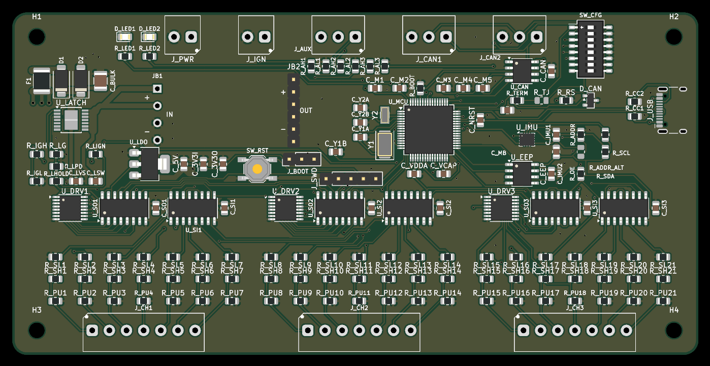

# RCM — Relay Control Module



A CAN-controlled relay driver for a car. **21 universal channels**, each of which is
simultaneously a low-side output *and* an input — so the same board builds as a relay
controller or as a switch panel, decided in firmware rather than by a different PCB.

Designed for a [rusEFI](https://rusefi.com/) bus (uaEFI SUPER ECU + uaDASH display), but
nothing about it is rusEFI-specific beyond the choice of message IDs.

---

## Status — read this first

**The boards were ordered on 2026-08-08 and have not been powered on.** The firmware is
written, builds, and passes 99 host unit tests against a simulated board, but **not one
line of it has run on real hardware.** The PCB has never been checked against a
multimeter.

Take it as a design worth reading, not a design worth trusting. If you build one, expect
to find things. `DESIGN.md` records what has already been found and fixed, which is a fair
guide to how much else is probably in there.

### What happens when it resets

This is a PDM. Running a main relay, a fuel pump and an injector feed is the job, not an
edge case. But there is one behaviour to design around:

**On any reset, `R_OE` parks all 21 channels high-impedance until firmware re-enables
them.** Every channel drops. The firmware detects a watchdog reset, skips its startup
diagnostics, applies `failsafe_state` and goes live immediately — the software part of
that is well under a millisecond, so the gap is dominated by crystal and PLL startup and
should land around **10 ms**. The self-test build reports its own measured figure; a scope
on any channel gives the true one including pre-`main()` time.

So the question for each load is not "is this engine-critical" but **"what does 10 ms off
do to it?"**

| Load | 10 ms off | Verdict |
|---|---|---|
| Fan, fuel pump, lights, horn, accessories | invisible | fine |
| Injector / coil supply via a main relay | at worst a single missed event | **fine — set `failsafe_state` to hold it on** |
| **ECU power itself** | the ECU reboots, which really is a stall | **give the ECU its own ignition-switched feed** |
| **Brake lights** | harmless in itself | **hardwire anyway** — see below |

**`failsafe_state` defaults to all-off.** That is right for lighting and wrong for anything
that should stay on when the bus goes quiet, and it is what the firmware applies coming out
of a watchdog reset. It is per-channel, so one board can drop its lighting and hold its
engine loads. Set it deliberately.

**Brake lights are a different argument.** Not dropout time — a hardwired brake switch is
simply simpler and more reliable than anything running on a microcontroller, and there is
no upside to inserting one. Wire the switch straight through, and tap the switched feed
into a spare channel set to `CH_INPUT` if you want the board to know about it. 1.2 mA, and
it cannot affect the lamps.

Roadworthiness and legal compliance of anything you build with this are yours.

---

## What it does

| | |
|---|---|
| **Channels** | 21, low-side switched, 7 per driver |
| **Drivers** | 3 × TPL7407L (MOSFET, not Darlington — see below) |
| **I/O expansion** | 74HC595 out / 74HC165 in, daisy-chained |
| **MCU** | STM32F446RET6, LQFP-64 |
| **Bus** | CAN, switchable termination, any exact bitrate |
| **Sensing** | every channel is read back continuously, including while driving |
| **IMU** | Bosch BMI270, 6-axis |
| **Board** | 140 × 70 mm, 4-layer, solid ground plane |

## Ratings

| | |
|---|---|
| Supply | 7–30 V (12 V nominal); board draws ~100 mA |
| **Per channel, one or two on** | **600 mA** sink, 30 V max |
| **Per channel, all 7 of a tile on** | **~250 mA** — limited by the driver package, not the silicon |
| All 21 channels | ~3.5 A total with typical 85 Ω relay coils |
| Ground return | **all channels share one pole on `J_PWR`**, ~8 A |
| Ambient | −20 to +70 °C |

The channels **switch relay coils, they do not carry load current** — that is the whole
architecture. `DESIGN.md` has the worked numbers, including why 600 mA is not an all-on
figure.

## The channel trick

Each channel's terminal connects to three things at once — a driver output, a permanently
connected 1M/270k sense divider, and a fitted 10k pull-down:

- **As an output** it sinks a relay coil to ground.
- **As an input** a button wired to +12V pulls it high; the pull-down gives 1.2mA of wetting
  current, enough to keep switch contacts from going oxide-flaky.
- **As a diagnostic**, because the divider never disconnects, an idle channel reads battery
  voltage through a healthy relay coil and 0V through a blown fuse. **Fuse detection falls
  out of the same wiring** — no extra parts.

Getting all three from one resistor took a few goes. A pull-*up* would have been the obvious
choice and it silently breaks fuse sensing: blown and healthy both read high, 20mV apart.

The same pull-down has a sting worth knowing: an un-driven channel is **not open**, it is
10k to ground, and it will pass ~1mA from anything pulled up to 12V. Relay coils ignore
that. Optocouplers and MOSFET gates do not — so a generic "active low" relay module wired
straight to a channel sits with its relays energised. `DESIGN.md` has the fix.

## Configuration

An 8-way DIP sets what can't be fixed over the bus once it's wrong:

| Pos | Function |
|---|---|
| 1 | CAN termination (passive, parallels a solder jumper) |
| 2 | Role — relay module or keypad |
| 3–4 | Node address |
| 5 | CAN bitrate — forces 500k, for when you configure yourself off the bus |
| 6 | Publish IMU data — only one board per car should |

Four relay modules and four keypads can share a bus. Everything else — channel modes,
bitrate, message IDs, failsafe states — lives in EEPROM and is changeable over CAN.

## Firmware

PlatformIO + STM32duino, in [`firmware/`](firmware/) — see
[`firmware/README.md`](firmware/README.md) for the detail.

- 21 channels, in or out per channel as a **software** table, changeable over CAN
- **Coil-circuit diagnosis** — blown fuse, missing relay, open coil or broken wire, all
  reported per channel, and a short-to-12V too
- CAN at **500 kbps by default and any exact bitrate you like**. Bit timing is solved at
  runtime for an 87.5% sample point; if a rate cannot be produced exactly, it refuses to
  start rather than running the bus 1% out
- Node addressing for 8 boards, CAN-loss failsafe, ignition-off shutdown, watchdog
- Optional **keypad → relay peer mirroring**, so a button panel can drive a relay module
  with no ECU in the middle

```
pio run -d firmware                     build
pio run -d firmware -e selftest -t upload   bring-up console over USB-C
pio test -d firmware -e native          99 host unit tests
```

**Two bring-up paths.** A **USB-C console** needs nothing but the cable — it proves the
DIP, the EEPROM, the CAN controller via internal loopback, the IMU, and walks all 21
channels. A **PC-side CAN tool** (`firmware/tools/rcm_bench.py`, any python-can interface)
does monitoring, commanding and the same channel walk over the bus.

The unit tests compile the firmware's own source against a model of the board — the shift
register chains bit by bit, each channel's electrical behaviour, and the EEPROM including
its page-wrap misbehaviour. They exist because the shift-register byte order is the one
thing in this design that cannot be checked by reading the code back.

### rusEFI

Message IDs were checked against rusEFI's own source rather than guessed. The board sits at
base `0x300`, clear of everything rusEFI uses (`0x100`/`0x102`, `0x130`/`0x131`, `0x190`,
`0x200`–`0x20B`, OpenBLT, OBD2). The base is configurable if it clashes with something on
your loom.

[`docs/rcm.dbc`](docs/rcm.dbc) is generated from the firmware headers, so **uaDASH and
TunerStudio can render channel state, inputs and faults with no custom display code**.

The BMI270 publishes as a **Bosch MM5.10** at `0x174`/`0x178`/`0x17C` — frames rusEFI
already decodes. Set `imuType = IMU_MM5_10` and yaw rate plus lateral, longitudinal and
vertical G appear in the ECU with nothing else to configure.

## Enclosure

[`enclosure/`](enclosure/) generates a sealed 3D-printable box and two lids — a keypad face
carrying eight 25 mm anti-vandal switches, and a blank plate for the relay-control build.
Wire entry is DEUTSCH DT, one aperture that fits 2, 3 and 4-way alike.

Like the PCB, it is generated by a script rather than modelled by hand; the `.FCStd` files
are output and are overwritten on every build.

## Building one

The schematic and PCB are **generated, not drawn**:

```
python gen_spec.py     ->  spec.json        the circuit, and the source of truth
python gen_plan.py     ->  board_plan.json  every part's physical position
tools/                                      schematic, placement, routing, export
```

Editing `rcm.kicad_sch` or `rcm.kicad_pcb` by hand gets overwritten. Change the generator.

`mfg/` holds the gerbers, BOM and CPL exactly as ordered, so you can send that folder to a
board house without running any of the above. It is set up for JLCPCB assembly: 4-layer,
leaded HASL, Standard PCBA (the BMI270's LGA-14 package requires it).

## Parts you must supply yourself

The board house builds the board. **These are not on the BOM and will not arrive with it** —
either because they do not mount to the PCB, or because no standard part fits.

### The buck module (required — the board does not power up without it)

A **Waveshare DC5-36-TO-DC3V3-5** step-down module, socketed onto `JB1`/`JB2`. It takes the
ignition-latched 12V rail down to 5V, which the on-board LDO then drops to 3V3.

**It ships set to 5V output and must stay that way.** Getting 3V3 from the module instead
needs per-unit pad rework, and forgetting it once puts 5V into a 3.3V MCU. The LDO exists
precisely so that step is never required.

Two things go with it:

| | |
|---|---|
| `JB2` (output, row of 6) | ordinary 2.54mm male header, **on the BOM** (`C37208`) |
| `JB1` (input, 4 pins) | **hand-fit** — 3.50mm pitch, no header is made at that spacing |

`JB1` needs four individual square pins. They set the module's ride height, so fit them
before anything else and get it square.

### Mating plugs for every terminal (required to connect anything)

The board carries the header halves; the screw plugs are yours to buy. `KF2EDGK-3.5-xP`,
also sold as `15EDGK-3.5`:

| Plug | LCSC | Mates with | Per board |
|---|---|---|---|
| 2P | `C440847` | `J_PWR`, `J_IGN` | 2 |
| 3P | `C440848` | `J_AUX`, `J_CAN1`, `J_CAN2` | 3 |
| 7P | `C440852` | `J_CH1`, `J_CH2`, `J_CH3` | 3 |

About $3.20 a board. Generic parts — any supplier stocks them.

> **Do not buy these into JLC's Parts Library expecting them to ship with the boards.**
> Confirmed the hard way on the 2026-08-08 order. That library is consignment stock for
> assembly runs, and JLC will only ship a part if the assembly process solders it down —
> a loose mating plug does not qualify. They will not add it to the board, and they will
> not put it in the box for a sane handling fee either. Money spent there is stuck: you
> own the parts and there is no way to take delivery of them.
>
> Buy the plugs somewhere else entirely.

### Optional

| | |
|---|---|
| `R_TJ` | 0R 0805 (`C17477`) — solder for permanent CAN termination instead of the DIP |
| Momentary buttons | for a keypad build: 8 off, positive-switched to +12V |
| USB-CAN adapter | for the PC-side tool. Get one with **slcan** firmware |

## Repository layout

```
gen_spec.py      -> spec.json         circuit definition, the source of truth
gen_plan.py      -> board_plan.json   every part's physical position
jlc_parts.json                        LCSC part per line; stamped into the schematic
tools/                                scripted-board pipeline
mfg/                                  gerbers, BOM, CPL as ordered
firmware/                             STM32 firmware, host unit tests, PC tools
enclosure/                            generated 3D-printable box and lids
docs/rcm.dbc                          CAN database, generated from the firmware headers
SPEC.md / DESIGN.md                   what was built, and why
```

## Honest notes

`DESIGN.md` is a decision log rather than a specification, and it keeps the mistakes in.
Some that seem worth repeating here:

**Three faults were caught after the board looked finished and every automated check was
green** — a missing ground pour, a reverse-polarity diode wired backwards, and stale
manufacturing files. Two were spotted by eye, not by tooling. ERC passes a diode in either
orientation, and DRC says nothing at all about an absent copper pour.

**The unit tests earned their keep before any hardware existed.** They caught a mirrored
shift-register byte order, a CAN filter that made every other filter decorative, four
broadcast frames being handed to three transmit mailboxes, and a multi-second output
dropout after a watchdog reset. The pattern in every case was two independent derivations
of the same fact disagreeing — which is why the tests model the hardware rather than
restating the driver.

**`JB1`** (the buck's input pins, 4 holes at 3.50mm pitch) is hand-fit — no header is made
at that pitch. Respacing it to 2.54mm is the obvious fix for a revision.

## Credits

`firmware/lib/bmi270/` is Bosch Sensortec's own
[BMI270 Sensor API](https://github.com/boschsensortec/BMI270_SensorAPI), vendored verbatim
under BSD-3-Clause. It carries the 8 KB configuration image the sensor needs at every
power-up, which is not something worth reimplementing.

## Licence

[MIT](LICENSE) — hardware design files included. Copy it, change it, sell it, no
attribution burden beyond keeping the notice.

MIT rather than a public-domain dedication for one reason: the **"AS IS, WITHOUT WARRANTY"**
clause. This switches vehicle electrics, and that paragraph is worth keeping.

Bosch's vendored BMI270 driver is separately licensed under BSD-3-Clause.
